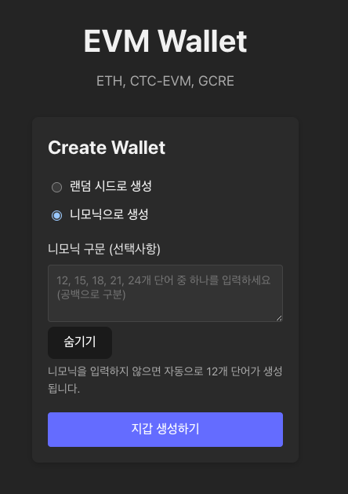

# EVM 지갑

### 1. 지갑 생성

- ethers.js 라이브러리를 사용하여 새로운 이더리움 지갑 생성
- 두 가지 지갑 생성 방식 지원:
  - **랜덤 시드 방식**: `new Wallet()` 메서드 활용
  - **니모닉 방식**: `ethers.Wallet.fromPhrase(mnemonic)` 메서드 활용
    - mnemonic(BIP-39) - Seed(512bit) - Master Extended Key(HD wallet 루트키, 파생 키 생성할 수 있는 키) - Private Key - Public Key - Address


#### new Wallet

```javascript
import { Wallet } from "ethers";

// 랜덤한 32바이트 개인키 생성
import { randomBytes } from "ethers";

const privateKey = randomBytes(32);

// 자동 생성
const wallet = new Wallet(privateKey);
// 직접 입력
const wallet = new Wallet("0x8a798...c9f");
```

랜덤 시드 방식에서 mnemonic을 생성하지 않는 `new Wallet`을 사용하면 비HD Wallet 생성 가능, 이 경우 mnemonic 없이 private key로 복구(공개키, 주소) 가능


#### HD Wallet

```text
# 하나의 니모닉-시드-마스터키에 여러 지갑 생성 가능

Mnemonic (니모닉)
   ↓
Seed (시드, 512비트)
   ↓
Master Key (루트 키, m)
   ├── m/44'/60'/0'/0/0   → 주소 A
   ├── m/44'/60'/0'/0/1   → 주소 B
   ├── m/44'/60'/0'/0/2   → 주소 C
   ├── m/44'/60'/0'/0/3   → 주소 D
   └── ...                → 무한히 파생 가능
```

| 항목      | HD Wallet (계층적 결정형 지갑)                 | 단일 지갑 (비-HD, 단순 개인키) |
| --------- | ---------------------------------------------- | ------------------------------ |
| 기반      | 니모닉 (Mnemonic), 시드 (Seed)                 | 단일 개인키 (Private Key)      |
| 표준      | BIP-32, BIP-39, BIP-44                         | 없음                           |
| 주소 수   | 무한히 파생 가능                               | 1개 고정                       |
| 파생 경로 | 사용 (예: `m/44'/60'/0'/0/n`)                  | 없음                           |
| 복구 방식 | 니모닉만 있으면 전체 복구 가능                 | 개인키가 없으면 복구 불가능    |
| 메서드    | `Wallet.fromPhrase()`, `Wallet.createRandom()` | `new Wallet(privateKey)`       |

### Public key 압축 vs 비압축

| 항목               | 압축 공개키          | 비압축 공개키      |
| ------------------ | -------------------- | ------------------ |
| 형식               | `0x02` or `0x03` + X | `0x04` + X + Y     |
| 길이               | 33 bytes (66 hex)    | 65 bytes (130 hex) |
| 크기               | 작음                 | 큼                 |
| 포함 정보          | X 좌표 + Y 짝/홀     | X + Y 좌표 모두    |
| 시작 바이트        | `0x02` 또는 `0x03`   | `0x04`             |
| Ethereum 주소 생성 | 불가능               | 가능               |



### 2. 니모닉 기능

- 사용자 지정 니모닉으로 지갑 생성 가능
  - BIP-39 표준 단어 유효성 검사
  - 마지막 단어 체크섬 검증
  - 12, 15, 18, 21, 24 단어 니모닉
- 니모닉 입력 지원 기능:
  - 자동 소문자 변환
  - 연속 공백 자동 정리
  - 입력 중 실시간 유효성 검사
- 니모닉 미입력 시 자동으로 12단어 니모닉 생성

<div style = "display: flex; gap :3px; margin-bottom : 10px">


</div>


### 3. 지갑 정보 표시

- 주소(Address), 공개키(Public Key), 개인키(Private Key), 니모닉(Mnemonic) 표시
- 보안을 위한 개인키 및 니모닉 마스킹 기능
- 모든 값 클립보드 복사 기능 지원

### 4. 잔액 조회 기능

- RPC 호출을 통한 지갑 잔액 조회:
  - ETH
  - CTC EVM
  - GCRE
- `provider.getBalance(address)` 메서드로 ETH 잔액 조회
- ERC-20 토큰의 경우 `contract.balanceOf(address)` 메서드로 잔액 조회

### 5. 다중 RPC 엔드포인트 지원

- 5개의 무료 RPC 엔드포인트 설정
- 첫 번째 RPC 호출 실패 시 자동으로 다음 RPC로 전환
- 순차적으로 각 RPC에 연결
```javascript
export const RPC_ENDPOINTS = [
  {
    name: "LlamaRPC",
    url: "https://eth.llamarpc.com",
  },
  {
    name: "PublicNode",
    url: "https://ethereum.publicnode.com",
  },
  {
    name: "1RPC",
    url: "https://1rpc.io/eth",
  },
  {
    name: "Flashbots",
    url: "https://rpc.flashbots.net",
  },
  {
    name: "Cloudflare",
    url: "https://cloudflare-eth.com",
  },
];
```
